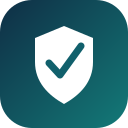
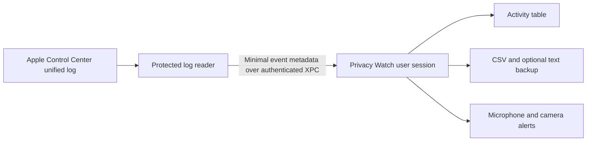

# Privacy Watch

**See the privacy activity your Mac reports. Keep a history you control.**

Privacy Watch is a free, native macOS app that keeps a searchable history of microphone, camera, screen capture and location activity reported by Apple Control Center. Review which applications appeared, get microphone and camera alerts, and save records in your own folder.

It runs quietly in the background, with optional menu-bar and Dock icons. There is no app account, subscription, telemetry or built-in cloud service.

[Get started](docs/INSTALLATION.md) · [User guide](docs/USER_GUIDE.md) · [Features and benefits](docs/FEATURES.md) · [Troubleshooting](docs/TROUBLESHOOTING.md)

## What it offers

| Feature | What it helps you do |
|---|---|
| Four sensor categories | Review reported microphone, camera, screen capture and location activity in one place. |
| Individual recording switches | Keep the categories that matter to you. |
| Microphone and camera start alerts | Notice new reported use without keeping the activity window open. |
| Native activity table | Search applications, bundle IDs, sensors, events and timestamps; filter by sensor, event or Today. |
| Your own CSV history | Keep a portable record that opens in your preferred spreadsheet or analysis tool. |
| Optional plain-text backup | Keep an additional readable, line-by-line event record. |
| Exact source timestamps | Preserve fractional seconds and UTC offsets in the CSV; read notification times in familiar AM/PM format. |
| Quiet background operation | Hide either or both icons, then reopen the app from Applications when needed. |
| Automatic launch and wake recovery | Resume collection when the app starts and recover after sleep or a temporary reader interruption. |
| Explicit Pause and Quit | Stop observation when you choose; Quit waits for the reader to stop. |
| Local processing | Keep activity records in the chosen folder without sending them to a service operated by the app. |
| Free local build | Run without a paid Apple Developer membership, full Xcode installation or recurring fee. |

## Get started

1. Obtain the app from this repository's [Releases](https://github.com/WebKroo/privacy-watch/releases), or [build it from source](docs/DEVELOPMENT.md).
2. Put **Privacy Watch.app** in Applications and open that copy.
3. Choose **Set Up & Start Logging** and approve the protected-log reader in the macOS administrator dialog.
4. Choose your sensors, log folder and alerts in **Settings**. Test a sensor and confirm a fresh activity row.

For automatic startup after sign-in, add Privacy Watch to macOS **Open at Login** and keep **Start logging automatically when the app opens** enabled. Each receiving Mac needs its own setup approval and notification permission.

**Current version: 1.4.1.** The app targets macOS 14 or later and builds for Apple Silicon and Intel. Runtime behavior was validated on Apple Silicon with macOS 27; other versions and Intel execution still require verification. This free build is locally signed and **not notarized**. Read the [installation guide](docs/INSTALLATION.md) before sharing or installing it.

## How it works

The privileged reader has a fixed log source and sends event metadata to the ordinary user-session app. The app handles files, interface and notifications. It does not capture microphone audio, camera video, screen images or location coordinates. Read the [architecture](docs/ARCHITECTURE.md) and [privacy notes](docs/PRIVACY.md).

## Understanding the history

Privacy Watch records **what Control Center reports**. It does not block sensor access or provide a complete security audit. Apple's log format is undocumented and can change after macOS updates.

A **First seen** row means an application was active when a new observation period began; it does not prove the exact moment the sensor physically started. Activity during sleep, pauses or disconnected periods is not reconstructed. **Logging** confirms the reader is connected; **Last verified update** and a deliberate sensor test confirm that recognized data is arriving.

## Documentation

- [Features and benefits](docs/FEATURES.md)
- [Installation and sharing](docs/INSTALLATION.md)
- [Everyday controls, alerts and CSV format](docs/USER_GUIDE.md)
- [Architecture and security boundaries](docs/ARCHITECTURE.md)
- [Privacy and data handling](docs/PRIVACY.md)
- [Troubleshooting and post-update checks](docs/TROUBLESHOOTING.md)
- [Migration from the original logger](docs/MIGRATION.md)
- [Clean uninstall](docs/UNINSTALL.md)
- [Build, test and release](docs/DEVELOPMENT.md)
- [Completed validation and remaining checks](VALIDATION.md)
- [Changelog](CHANGELOG.md), [contributing](CONTRIBUTING.md) and [security reporting](SECURITY.md)

## Licensing

Copyright © 2026 WebKroo. Licensed under the **GNU Affero General Public License v3.0 only (AGPL-3.0-only)**. See [LICENSE](LICENSE) for the full terms and [COPYRIGHT](COPYRIGHT) for the project notice.
