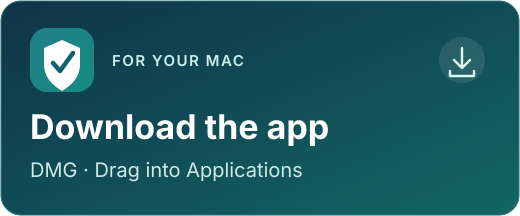
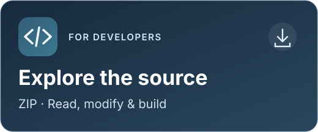
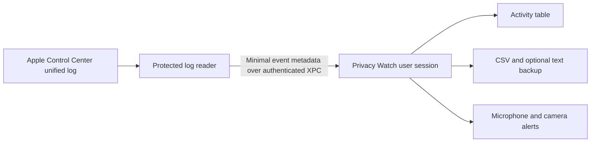

# Privacy Watch

**See the privacy activity your Mac reports. Keep a history you control.**

Privacy Watch is a free, native macOS app that keeps a searchable history of microphone, camera, screen capture and location activity reported by Apple Control Center. Review which applications appeared, get microphone and camera alerts, and save records in your own folder.

It runs quietly in the background, with optional menu-bar and Dock icons. There is no app account, subscription, telemetry or built-in cloud service. Optional update checks contact GitHub for public release information; activity logs are never sent.

[Get started](#get-started) · [User guide](docs/USER_GUIDE.md) · [Features and benefits](docs/FEATURES.md) · [Troubleshooting](docs/TROUBLESHOOTING.md)

## What it offers

| Feature | What it helps you do |
|---|---|
| Four sensor categories | Review reported microphone, camera, screen capture and location activity in one place. |
| Individual recording switches | Keep the categories that matter to you. |
| Microphone and camera start alerts | Notice new reported use without keeping the activity window open. |
| Native activity table | Search applications, bundle IDs, sensors, events and timestamps; filter by sensor, event or Today. |
| Combined activity and durations | Keep an app's start and stop in one row and see how long it was observed active. Switch back to separate events whenever you prefer. |
| Compact rows | Fit more activity on screen with a single-line layout in the menu and activity table. |
| Five-item menu history | See the latest matching events or combined activities; choose sensors and event types independently of recording. |
| Your own CSV history | Keep a portable record that opens in your preferred spreadsheet or analysis tool. |
| Optional plain-text backup | Keep an additional readable, line-by-line event record. |
| Exact source timestamps | Preserve fractional seconds and UTC offsets in the CSV; read notification times in familiar AM/PM format. |
| Quiet background operation | Hide either or both icons, then reopen the app from Applications when needed. |
| Automatic launch and wake recovery | Resume collection when the app starts and recover after sleep or a temporary reader interruption. |
| Explicit Pause and Quit | Stop observation when you choose; Quit waits for the reader to stop. |
| Local processing | Keep activity records in the chosen folder without sending them to a service operated by the app. |
| Optional update checks | Check GitHub daily, weekly or monthly, or check manually; choose when to download and install. |
| Free local build | Run without a paid Apple Developer membership, full Xcode installation or recurring fee. |

## Get started

Choose the app to get up and running, or download the source to explore and build it yourself.

<table>
<tr>
<td width="50%" valign="top">

Ready to install on your Mac. No build tools needed.

<strong><a href="https://github.com/WebKroo/privacy-watch/releases/download/v1.7.0/Privacy-Watch-1.7.0.dmg">Download DMG</a></strong> · <a href="docs/INSTALLATION.md">Installation guide</a>

</td>
<td width="50%" valign="top">

Read the code, make changes or build your own app.

<strong><a href="https://github.com/WebKroo/privacy-watch/releases/download/v1.7.0/Privacy-Watch-1.7.0-source.zip">Download source ZIP</a></strong> · <a href="docs/DEVELOPMENT.md">Build guide</a>

</td>
</tr>
</table>

[Release notes, app ZIP and checksums](https://github.com/WebKroo/privacy-watch/releases/tag/v1.7.0) · [Browse the source](https://github.com/WebKroo/privacy-watch/tree/v1.7.0)

**Install in three steps**

> [!IMPORTANT]
> **First launch: “Privacy Watch” Not Opened**
>
> This free release has not been notarized by Apple. If you trust this project's download and choose to open it:
>
> 1. Click **Done** on the warning to keep the app.
> 2. Open **System Settings → Privacy & Security**. Scroll the **main pane on the right** down to **Security**, near the bottom of the page.
> 3. Look for **“Privacy Watch” was blocked to protect your Mac.** Click **Open Anyway** on the right of that message, just above **FileVault**. Confirm **Open** and authenticate if prompted.
>
> **Privacy Watch appears in this temporary blocked-app message, not in the lists of Camera, Microphone or other app permissions.** If the message is missing, try opening the app again, click **Done**, then return to this area of Settings. BlockBlock may ask for a separate approval. See the [full opening instructions](docs/INSTALLATION.md#if-macos-or-blockblock-stops-the-app-from-opening).

1. Open the DMG and drag **Privacy Watch.app** onto its **Applications** shortcut. Eject the disk image, then open Privacy Watch from Applications.
2. Choose **Set Up & Start Logging** and approve the protected-log reader in the macOS administrator dialog.
3. Choose your sensors, log folder and alerts in **Settings**. Test a sensor and confirm a fresh activity row.

For automatic startup after sign-in, add Privacy Watch to macOS **Open at Login** and keep **Start logging automatically when the app opens** enabled. Each receiving Mac needs its own setup approval and notification permission.

**Current version: 1.7.0.** The app targets macOS 14 or later and builds for Apple Silicon and Intel. Runtime behavior was validated on Apple Silicon with macOS 27; other versions and Intel execution still require verification. This free build is locally signed and **not notarized**. Read the [installation guide](docs/INSTALLATION.md) before sharing or installing it.

## How it works

### In plain language

Privacy Watch helps you look back at which apps your Mac reported using your microphone, camera, screen capture or location, and when.

1. **Your Mac reports activity.** macOS creates reports when it notices apps using these features. Privacy Watch reads those reports while logging is on.
2. **Privacy Watch keeps a history.** It saves the app name, type of activity and reported time in a folder you choose.
3. **You review it when you want.** Search the history inside the app, open the saved file in a spreadsheet, or turn on alerts for microphone and camera starts.
4. **You stay in control.** Choose which activity to save, pause logging, or quit to stop it. You can hide the app's icons and reopen it from Applications to see your history and settings.

For example, when macOS reports FaceTime using your camera, Privacy Watch can add that activity to your history and show an alert if camera notifications are enabled.

Privacy Watch does not record your conversations, take photos, copy your screen or save your location coordinates. It does not upload your activity history. If you choose a folder synced by iCloud or another service, that service may sync the saved files.

It can only record what macOS reports while logging is running. It does not block other apps from using these features or fill in missing activity from sleep or pauses.

### Under the hood

The privileged reader has a fixed log source and sends event metadata to the ordinary user-session app. The app handles files, interface and notifications. It does not capture microphone audio, camera video, screen images or location coordinates. Read the [architecture](docs/ARCHITECTURE.md) and [privacy notes](docs/PRIVACY.md).

## Understanding the history

Privacy Watch records **what Control Center reports**. It does not block sensor access or provide a complete security audit. Apple's log format is undocumented and can change after macOS updates.

A **First seen** row means an application was active when a new observation period began; it does not prove the exact moment the sensor physically started. Activity during sleep, pauses or disconnected periods is not reconstructed. **Logging** confirms the reader is connected; **Last verified update** and a deliberate sensor test confirm that recognized data is arriving.

## Documentation

- [Features and benefits](docs/FEATURES.md)
- [Installation and sharing](docs/INSTALLATION.md)
- [Everyday controls, alerts and CSV format](docs/USER_GUIDE.md)
- [Architecture and security boundaries](docs/ARCHITECTURE.md)
- [Privacy and data handling](docs/PRIVACY.md)
- [Troubleshooting and post-update checks](docs/TROUBLESHOOTING.md)
- [Migration from the original logger](docs/MIGRATION.md)
- [Clean uninstall](docs/UNINSTALL.md)
- [Build, test and release](docs/DEVELOPMENT.md)
- [Completed validation and remaining checks](VALIDATION.md)
- [Changelog](CHANGELOG.md), [contributing](CONTRIBUTING.md) and [security reporting](SECURITY.md)

## Licensing

Copyright © 2026 WebKroo. Licensed under the **GNU Affero General Public License v3.0 only (AGPL-3.0-only)**. See [LICENSE](LICENSE) for the full terms and [COPYRIGHT](COPYRIGHT) for the project notice.
